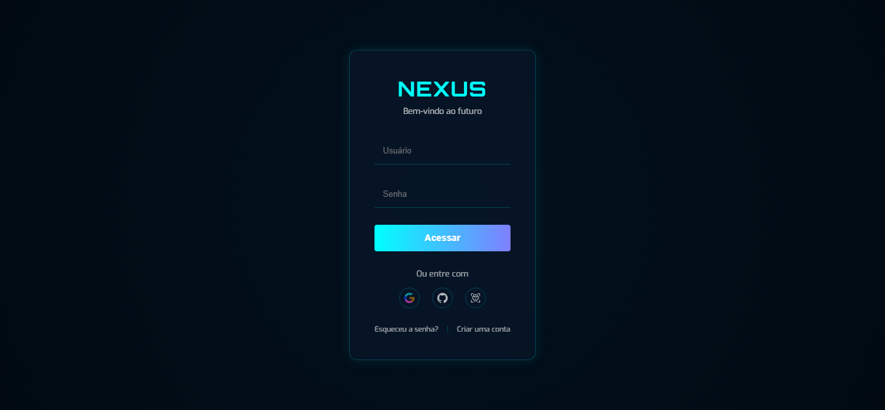

## Nexus | Tela de Login

Bem-vindo ao **Nexus**, uma interface de login moderna e futurista desenvolvida com HTML e CSS. Este projeto tem como objetivo oferecer uma experiência de autenticação visualmente atrativa, com suporte para login tradicional e integração com ícones de redes sociais.

## 🔥 Demonstração

 <!-- Você pode adicionar uma imagem de preview aqui -->

## ✨ Funcionalidades

- ✅ Design responsivo e adaptado para diferentes dispositivos
- ✅ Campos de entrada para usuário e senha
- ✅ Animação de fundo dinâmica
- ✅ Login alternativo com ícones sociais (Google, GitHub, Reconhecimento Facial)
- ✅ Links para "Esqueceu a senha?" e "Criar conta"
- ✅ Tipografia moderna usando Google Fonts (Exo e Orbitron)
- ✅ Ícones personalizados para cada rede social.

## 🛠️ Tecnologias Utilizadas

- **HTML5**
- **CSS3**
- **Google Fonts**
- **Ícones personalizados**

## 📁 Estrutura de Arquivos

Nexus-Login/
├── index.html
├── style.css
├── preview.png
├── Img/
│   ├── search.png
│   ├── github.png
│   └── reconhecimento-facial (1).png
│   └── google.png
└── README.md
----

## 🚀 Como Usar

- Clone ou baixe este repositório:

- Git clone https://github.com/seu-usuario/nexus-login.git

- Abra o arquivo index.html em seu navegador.

- Customize conforme suas necessidades (ex: adicionar backend para autenticação real).

## 📌 Observações

- Este projeto é apenas a interface visual. Não possui integração com backend para autenticação real.

- Os botões de login social são apenas ilustrativos (sem funcionalidade real).

- Certifique-se de que os ícones de redes sociais estejam corretamente referenciados.

- Este projeto é apenas para fins educacionais e de demonstração.

## 🤝 Contribuição

 *Contribuições são bem-vindas! Se você deseja contribuir para este projeto, siga estas etapas:*
- Faça um fork deste repositório.
- Crie uma nova branch para suas alterações: git checkout -b minha-nova-funcionalidade.
- Faça as alterações desejadas e faça commit delas: git commit -m 'Adiciona nova funcionalidade'.
- Envie suas alterações para o repositório remoto: git push origin minha-nova-funcionalidade.
- Abra um pull request neste repositório.

## 📞 Contato

- Se você tiver alguma dúvida ou sugestão, entre em contato comigo em [seu-email@example.com](heloiltonsl@gmail.com).

## 📄 Licença

- Este projeto está licenciado sob a MIT License.

## 📝 Autor

- Desenvolvido com ❤️ por ***Heloy Souza***.

